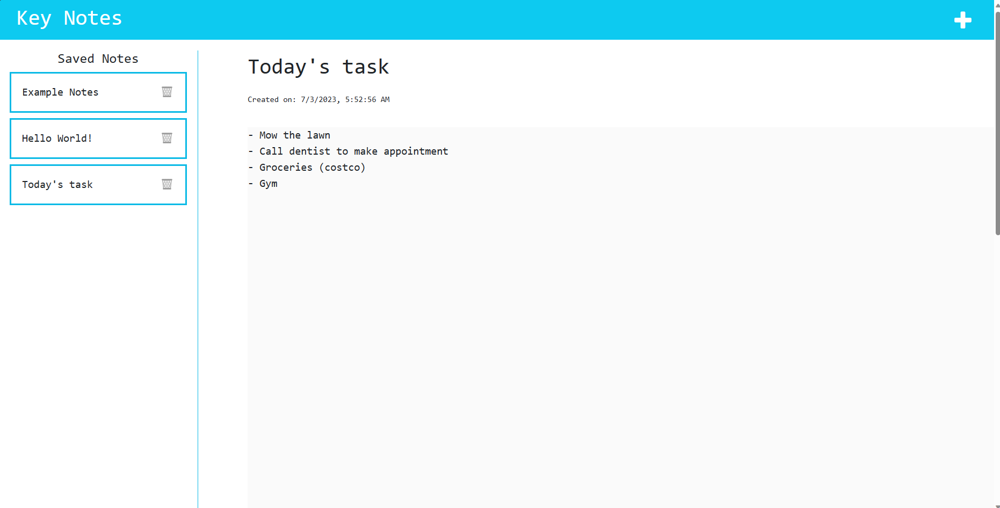

# Note Taker 

# Table of Contents
* [Usage](#usage)
* [Description](#usage)
* [URL](#URL)
* [Screenshots](#Screenshots)
* [Contributors](#contributors)
* [License](#license)
* [Contacts](#contacts)
  
## Usage
This app is use to helps everyday user to take down notes, prepare daily errands, activities, etc or organize schedules.
  
## Description
This app includes a title that can be click to refresh the page, a saved notes section to store any notes that the user saves and is clickable to view the inside content and will be displayed to the right hand side with the added created date that will automatically takes the date and the time the note is save. Another function is the add button or the "plus" icon that can be click to add new notes. Lastly, an extra feature that i included is for the user to be able to delete each of the notes individually.
  
## URL 

https://software-engineer-blogspot-48f56e664ad0.herokuapp.com/

## Screenshots
Homepage 

## Contributors
Junnel R. Padilla, UC Berkeley Bootcamp Modules, ChatGPT
  
## License
This project is licensed under [MIT](https://opensource.org/licenses/MIT)

## Questions?
* Name: Junnel R. Padilla
* Github: https://github.com/jayP308
* LinkedIn: https://www.linkedin.com/in/jp-padilla-038854251/